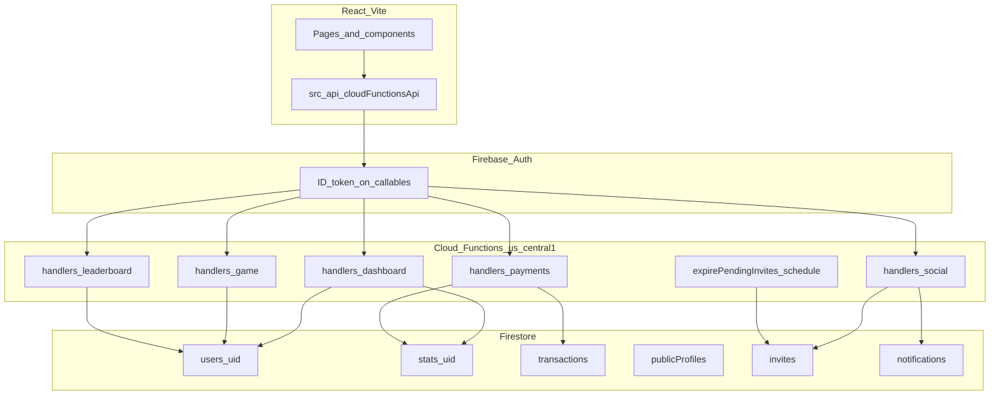

# Skilz — Architecture and Security Documentation

## 1. Project overview

Skilz is a gaming platform built with:

- **Frontend:** React 19 + Vite (`src/`), Redux for auth and user stats UI, React Router.
- **Backend (optional):** Node/Express (`server.js`, `controllers/`, `routes/`) for legacy APIs, sockets, and Admin SDK operations where configured.
- **Firebase:** Authentication, Firestore, Storage, Realtime Database (optional URL), **Cloud Functions** (`functions/`) for server-authoritative economy and dashboard reads.

The web app is the primary client; sensitive wallet and aggregate mutations are intended to go through **callable Cloud Functions** using the Firebase Admin SDK, not direct client writes to protected fields.

---

## 2. Architecture flow

**Principle:** The browser uses **Firebase Auth**. Callables receive `request.auth.uid`. **Writes** to economy-related user fields and billing aggregates run in Functions (Admin SDK). Firestore **security rules** block client tampering of those fields where enforced.

---

## 3. Function map

| Callable | Auth | Input (request.data) | Output | Firestore effects |
|----------|------|------------------------|--------|-------------------|
| `getPlayerDashboard` | Required | (ignored) | `{ stats, gameStats, ranking }` | Read `users/{uid}`, `stats/{uid}` |
| `getPlayerBilling` | Required | (ignored) | `{ transactions, stats }` | Read `transactions`, `stats/{uid}` |
| `addTransaction` | Required | `amountSpent`, `coinsEarned`, `paymentMethod` | `{ transactionId }` | Create `transactions/{id}`, merge `stats/{uid}` |
| `updateGameStats` | Required | `coinsDelta`, `xpDelta`, `winsDelta`, `lossesDelta`, `challengesDelta`, `monthKey?`, `mathRush?` | `{ coins, xp }` | Transactional update `users/{uid}` (caps on deltas) |
| `getLeaderboard` | Required | `limit?` (default 20, max 50) | `{ entries: [...] }` | Admin query `users` orderBy `xp` desc |
| `sendChallenge` | Required | `toUserId`, `gameId`, `gameName?` | `{ inviteId }` | Transaction: create `invites/{id}` + `notifications` for recipient; friendship + duplicate-pending + max 10 outbound `pending` per sender |
| `acceptChallenge` | Required | `inviteId` | `{ ok, status, matchId, gameId }` (idempotent if already accepted) | Transaction: create `matches/{matchId}` (`playerIds`, `status: forming`, `inviteId`), set invite `accepted` + `matchId`; `match_ready` notifications to **both** players; blocks if either player has an active match (`forming` / `ready` / `in_progress`) |
| `rejectChallenge` | Required | `inviteId` | `{ ok, status }` | Recipient sets invite `rejected`; `invite_response` notification to sender |
| `markNotificationRead` | Required | `notificationId` | `{ ok }` | Owner sets `read: true` on `notifications/{id}` |
| `listAvailablePlayers` | Required | `limit?` (max 50) | `{ players: [...] }` | Admin reads friend graph, RTDB `presence/{uid}` per friend, skips in-game + pending invites |

**Scheduled:** `expirePendingInvites` (hourly) marks `invites` with `status == pending` and `createdAt` older than 48h as `expired`.

**Module layout (service-style split):**

- `functions/lib/admin.js` — Firebase Admin init + `db` + `getRtdb()` (RTDB URL aligned with the web app)
- `functions/lib/serialize.js` — Timestamp-safe JSON for responses
- `functions/lib/dashboardBuilders.js` — Pure helpers for dashboard payload
- `functions/handlers/dashboard.js` — `getPlayerDashboard`, `getPlayerBilling`
- `functions/handlers/payments.js` — `addTransaction`
- `functions/handlers/game.js` — `updateGameStats` (anti-cheat caps)
- `functions/handlers/leaderboard.js` — `getLeaderboard`
- `functions/handlers/social.js` — challenges, notifications, available friends, invite expiry helper
- `functions/index.js` — `onCall` exports + `onSchedule` for expiry

---

## 4. Data flow

### Coins and XP

1. Client calls `callUpdateGameStats` (`src/api/cloudFunctionsApi.js`).
2. Function `updateGameStats` runs a **Firestore transaction** on `users/{uid}`:
   - Clamps per-request deltas (e.g. coins, XP, wins).
   - Rejects if coins would go negative.
   - May update `stats.wins`, `stats.losses`, `stats.totalMatches`, Math Rush counters, `monthlyGameStats`, `rankingHistory`.

### Billing aggregates

1. Client calls `callAddTransaction` (used from `playerBillingApi.addTransaction`).
2. Function writes a `transactions` row and increments `stats/{uid}` (`totalSpent`, `totalCoins`).

### Dashboard UI

1. `fetchPlayerDashboard` → `getPlayerDashboard` returns computed top stats and chart series from `users` + `stats` (no synthetic billing-to-wins mapping on the client).

### Leaderboard

1. `fetchLeaderboard` → `getLeaderboard` uses Admin SDK to query users by `xp` (requires index in `firestore.indexes.json`).
2. Response exposes only **public-safe** fields (no email).

### Social (friends tab)

1. **Reads:** Friend IDs merge `users/{uid}/friends/*` and `friends/{uid}.friendsList`. Profiles prefer `publicProfiles/{id}`. Notifications: query `notifications` where `userId == auth.uid` (composite index in `firestore.indexes.json`).
2. **Mutations:** `friendsDashboardApi` keeps the same exported names (`sendInvite`, `updateInviteStatus`, `markNotificationRead`) but calls **`sendChallenge`**, **`acceptChallenge`**, **`rejectChallenge`**, **`markNotificationRead`** callables so `fromUserId` / writes cannot be forged from the browser. `updateInviteStatus(..., 'accepted')` returns callable data including **`matchId`** and **`gameId`** for navigation.
3. **Presence:** RTDB `presence/{uid}` — client writes only own node (see `database.rules.json`). The friends UI subscribes **per-friend** paths via `subscribePresenceForUserIds`, not the entire `presence` tree.
4. **Available to play:** `listAvailablePlayers` uses Admin + RTDB to return online friends who are not `in-game` and have no pending invite with the caller; the Friends page shows this as a second list.
5. **Notifications UI:** [`PlayerNotificationsProvider`](C:\SkilzBranch\SkilzProject\src\context\PlayerNotificationsContext.jsx) wraps the player dashboard layout and legacy `/playerFriendList`; a **single** `onSnapshot` drives the bell + dropdown in [`Topbar`](C:\SkilzBranch\SkilzProject\src\Components\sidebar\Topbar.jsx) via [`PlayerTopbarNotifications`](C:\SkilzBranch\SkilzProject\src\Components\sidebar\PlayerTopbarNotifications.jsx). Notification types include `invite`, `invite_response`, **`match_ready`** (with `matchId`, `gameId` for **Join** → lobby URL from [`buildLobbyPathWithMatch`](C:\SkilzBranch\SkilzProject\src\utils\gameLobbyRoutes.js)).
6. **Friend match session:** Accepting creates **`matches/{matchId}`** (Functions-only write). Lobbies read `?matchId=` and show [`FriendMatchSessionBanner`](C:\SkilzBranch\SkilzProject\src\components\friends\FriendMatchSessionBanner.jsx) (live `onSnapshot` on the match doc). Optional socket: server emits `friend_match_join_ok` after validating the user is in `playerIds` (`server.js` → `friend_match_join`).

---

## 5. Security model

### Firestore rules (summary)

- **`users/{userId}`:** Owner read. **Update** cannot change `coins`, `xp`, `earnedCoins`, `level`, `dailyStreak`, `stats`, `games`, **`monthlyGameStats`**, **`rankingHistory`**. **Create:** if `coins` / `xp` are present, they must be within caps.
- **`stats/{userId}`:** Owner read; **no client write** (Functions only).
- **`transactions/{txId}`:** Owner read; **no client write** (Functions only).
- **`cards/{cardId}`:** Owner CRUD (masked card data only in app logic).
- **`publicProfiles/{userId}`:** Authenticated read; owner write (mirror for social features; level/xp here are client-written — consider hardening later).
- **`friends/{userId}`:** Owner read/write (denormalized `friendsList`; `ensureFriendsDoc` on the client).
- **`invites/{inviteId}`:** Read if `request.auth.uid` is `fromUserId` or `toUserId`; **no client create/update/delete** (Cloud Functions only).
- **`notifications/{notifId}`:** Read if `userId == request.auth.uid`; **no client create/update/delete** (use `markNotificationRead` callable).
- **`matches/{matchId}`:** Read if `request.auth.uid in resource.data.playerIds`; **no client write** (created when a challenge is accepted via `acceptChallenge`).

### Client hardening

- `userService.updateCoins` / `updateXP` / `addCoins` / `deductCoins` / `updateDailyStreak` / `recordGameOutcome` **throw**; use `callUpdateGameStats` instead.
- `profileApi.updateUserProfile` / `patchUserProfile` **strip** economy-related keys before write.

### Residual risks / second trust boundary

- **Express + Firebase Admin** (`services/userFirestoreAdmin.js`, `controllers/`) can still mutate Firestore. Treat as a separate, server-only trust zone; protect routes with auth.
- **`lobbies`** allow broad authenticated writes — not part of wallet security but worth tightening later.
- **`subscribeLeaderboardUsers`** snapshots all `users`; **rules block** cross-user reads in production — use **`fetchLeaderboard`** instead.

### Anti-cheat (Functions)

- `updateGameStats` enforces **maximum deltas** per request for coins, XP, wins, losses, and challenges.

---

## 6. API map

### HTTPS callables (client)

| Client helper | Callable name |
|---------------|---------------|
| `callGetPlayerDashboard` | `getPlayerDashboard` |
| `callGetPlayerBilling` | `getPlayerBilling` |
| `callAddTransaction` | `addTransaction` |
| `callUpdateGameStats` | `updateGameStats` |
| `callGetLeaderboard` | `getLeaderboard` |
| `callSendChallenge` | `sendChallenge` |
| `callAcceptChallenge` | `acceptChallenge` |
| `callRejectChallenge` | `rejectChallenge` |
| `callMarkNotificationRead` | `markNotificationRead` |
| `callListAvailablePlayers` | `listAvailablePlayers` |

Configured in `src/firebase/functionsClient.js` with region from `VITE_FIREBASE_FUNCTIONS_REGION` (default **`us-central1`**, must match `functions/index.js`).

### Notable Express surface (if enabled)

- Game and user routes under `/api/*` (see `routes/`, `controllers/`). These may sync wallets when `FIREBASE_SYNC_WALLET` or similar env flags are set. Document any production route in your deployment runbook.

---

## 7. Local development

- **Vite:** `npm run dev` / `npm run dev:vite`
- **Functions region:** Set `VITE_FIREBASE_FUNCTIONS_REGION=us-central1` in `.env` unless you change `setGlobalOptions` in `functions/index.js`.
- **Emulators:** `VITE_USE_FUNCTIONS_EMULATOR=true` connects to `127.0.0.1:5001` (see `functionsClient.js`).
- **Deploy:**  
  `firebase deploy --only functions,firestore:rules,firestore:indexes`

---

## 8. Verification checklist

- [ ] `npm run build` succeeds.
- [ ] `node --check functions/index.js` succeeds.
- [ ] Deploy Functions + rules + indexes.
- [ ] Signed-in user: dashboard loads via `getPlayerDashboard`.
- [ ] Second user: does not see first user’s stats.
- [ ] Direct Firestore client update to `coins` on own user doc fails rules.
- [ ] Leaderboard returns entries after index build (check Firebase console if query errors).
- [ ] Friends: send/accept/reject challenge works; direct Firestore write to `invites` or `notifications` fails rules.
- [ ] `listAvailablePlayers` returns expected subset when RTDB presence is set.
- [ ] Player dashboard **Topbar** shows notification bell + live badge; accepting an invite creates `matches/{id}` and navigates to the correct lobby with `?matchId=`.
- [ ] Optional: socket `friend_match_join` returns `friend_match_join_ok` when Firestore Admin is configured on `server.js`.

---

*Last updated to reflect `acceptChallenge` → `matches` + `match_ready` notifications, dashboard `PlayerNotificationsProvider` / Topbar bell, lobby `FriendMatchSessionBanner`, and `friend_match_join` socket validation.*
