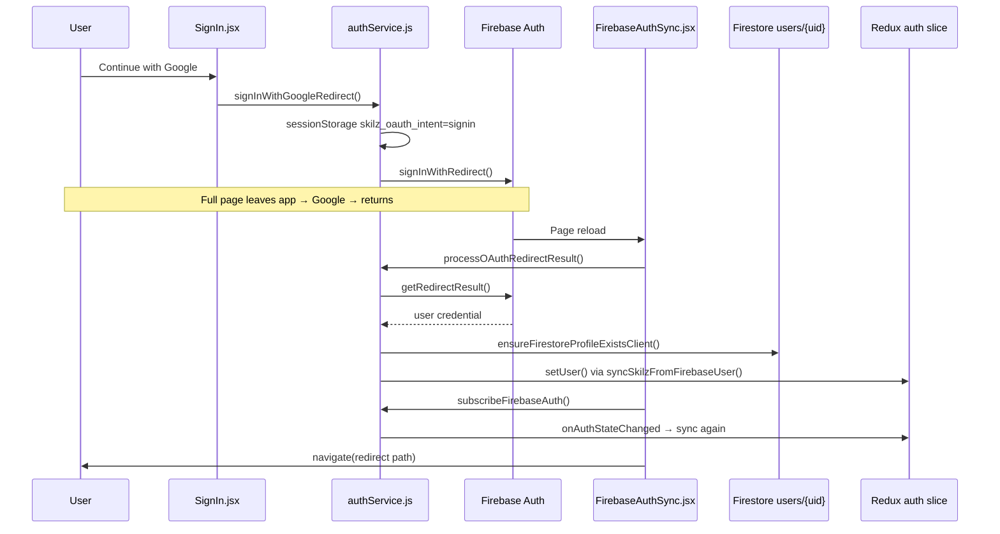

# Skilz Authentication — End-to-End Analysis

> **Purpose:** Explain why Google/Facebook login can complete the OAuth screens but the player still appears logged out, how OTP fits in, and exactly what to fix.
>
> **Scope:** `SignIn.jsx`, `SignUp.jsx`, `ForgetPass.jsx`, `authService.js`, `FirebaseAuthSync.jsx`, backend `/api/auth/*`, Firestore rules.

---

## 1. How login is supposed to work (high level)

Skilz uses a **two-layer** session model:

| Layer | What it is | Where it lives |
|-------|------------|----------------|
| **Firebase Auth** | Identity (email, Google, Facebook, phone link) | Firebase SDK, `auth.currentUser` |
| **Skilz app session** | Redux `auth.user` + `auth.isAuthenticated` | Set by `syncSkilzFromFirebaseUser()` |

**The UI does not read `auth.currentUser` directly.** The header, game gates, and dashboard all read Redux:

```268:283:frontend/src/Components/Header.jsx
      {!authUser ? (
        <div className="nav-auth-buttons">
          ...
        </div>
      ) : (
        <div className="header-user-controls">
```

```8:25:frontend/src/Components/ProtectedGameRoute.jsx
export default function ProtectedGameRoute({ children }) {
    const firebaseReady = useSelector((s) => s.auth.firebaseReady);
    const isAuthenticated = useSelector((s) => s.auth.isAuthenticated);
    ...
    if (!isAuthenticated) {
        return <Navigate to="/signin" replace state={{ redirectTo: `${location.pathname}${location.search}` }} />;
    }
```

**You are only “logged in” in the app when `syncSkilzFromFirebaseUser` succeeds and dispatches `setUser`.** Firebase can briefly have a user while Redux still shows logged out — or Firebase gets signed out again if sync fails.

---

## 2. Architecture diagram



**Critical orchestrator:** `FirebaseAuthSync` must run on every page load (it does — mounted in `App.jsx`).

```12:32:frontend/src/Components/FirebaseAuthSync.jsx
export default function FirebaseAuthSync() {
  const navigate = useNavigate();
  useEffect(() => {
    ...
    const r = await processOAuthRedirectResult().catch(() => ({ status: 'none' }));
    ...
    unsub = subscribeFirebaseAuth();
    if (r.status === 'ok' && r.navigateTo) {
      navigate(r.navigateTo, { replace: true });
    }
  }, [navigate]);
```

---

## 3. Auth flows — what each screen actually does

### 3.1 Sign In (`SignIn.jsx`)

| Method | Entry | Backend of flow |
|--------|-------|-----------------|
| Email + password | Form submit | `signInWithEmail` → `finalizeSignIn` → `syncSkilzFromFirebaseUser` |
| Google | Button | `signInWithGoogleRedirect` → **full page redirect** → `processOAuthRedirectResult` on return |
| Facebook | Button | Same as Google |
| Dev console OTP | Dev only (`VITE_ENABLE_DEV_CONSOLE_OTP`) | `/api/auth/dev-console-otp/*` — **not** Firebase |

**Important:** After `signInWithGoogleRedirect`, the lines `navigate(redirectTo)` in `SignIn.jsx` **never run on success** because the browser navigates away to Google. Completion happens in `FirebaseAuthSync`, not in the button handler.

### 3.2 Sign Up (`SignUp.jsx`) — 3 steps (production path)

| Step | What happens |
|------|----------------|
| **1** | Email/password → `createUserWithEmailAndPassword`. **Or** Google/Facebook → immediate redirect (skips steps 2–3). |
| **2** | Confirms email + DOB, then sends SMS via `linkWithPhoneNumber` + reCAPTCHA |
| **3** | `SignUpOtp.jsx` — 6-digit Firebase SMS code → `createUserProfile()` in Firestore |

**Social sign-up does not go through phone OTP.** Clicking “Continue with Google” on step 1 redirects immediately; steps 2–3 are bypassed. Profile is created in `ensureFirestoreUserProfile` on OAuth return (minimal fields only).

### 3.3 Forgot password (`ForgetPass.jsx`)

Works via Firebase `sendPasswordResetEmail` — sends a link from Firebase email templates. **Functional.**

`SetNewPassword.jsx` is **not wired** — it shows a stub error and does not call `confirmPasswordReset`.

### 3.4 OTP — what is real vs mock

| OTP type | Status | Notes |
|----------|--------|-------|
| Sign-up SMS (step 3) | **Real Firebase** | 6 digits, `confirmationResult.confirm(code)` |
| Legacy 4-digit mock | Only if `VITE_LEGACY_SIGNUP=true` | Logged to browser console — not production |
| Server `/api/auth/verify-otp` | **501 Not Implemented** | Intentionally disabled |
| Dev console OTP | Dev server only | `ENABLE_DEV_CONSOLE_OTP=1` on backend |

---

## 4. The original error — why OAuth “finishes” but user is not logged in

### Root cause A (most likely): **Sync fails → app forces sign-out**

Both OAuth completion and the ongoing auth listener **sign the user out of Firebase** if Skilz sync throws:

```116:138:frontend/src/services/authService.js
  try {
    if (intent === 'signup') {
      await ensureFirestoreUserProfile(result.user);
    }
    await finalizeSignIn(result.user);
  } catch (e) {
    ...
    await signOut(auth).catch(() => {});
    return { status: 'none' };
  }
```

```646:667:frontend/src/services/authService.js
export function subscribeFirebaseAuth() {
  return onAuthStateChanged(auth, async (firebaseUser) => {
    try {
      if (!firebaseUser) { ... return; }
      await syncSkilzFromFirebaseUser(firebaseUser);
    } catch (e) {
      console.error('[auth] Firebase session sync failed:', e);
      await signOut(auth).catch(() => {});
      ...
    }
```

**What the user experiences:**

1. Google/Facebook screens complete successfully.
2. App reloads.
3. Firebase briefly has a user.
4. `syncSkilzFromFirebaseUser` tries to read/create `users/{uid}` in Firestore.
5. If that fails (permissions, network, rules), **Firebase sign-out runs**.
6. Header still shows “Login / Sign Up”.
7. User thinks OAuth “did nothing”.

**Common Firestore failure triggers:**

- `permission-denied` on `users/{uid}` create/read
- User not authenticated yet when Firestore write runs (timing)
- Browser blocking storage → Firebase persistence issues

### Root cause B: **Error message is hidden**

Failures store a message in `sessionStorage` under `skilz_auth_notice`, but **only `/signin` and About page read it** — not Home:

```51:60:frontend/src/Components/authPages/SignIn.jsx
  useEffect(() => {
    try {
      const n = sessionStorage.getItem("skilz_auth_notice");
      if (n) {
        setError(n);
        sessionStorage.removeItem("skilz_auth_notice");
      }
```

If OAuth returns to `/` (default), the user sees logged-out UI **with no explanation**.

### Root cause C: **Account linking required (same email, different provider)**

If the email already exists with **password** and the user clicks **Google**, Firebase returns `auth/account-exists-with-different-credential`.

The app does **not** log them in. It shows a linking banner and stores `skilz_link_hint`. User must sign in with the **original** method first, then link.

```405:440:frontend/src/services/authService.js
async function handleAccountExistsDifferentProvider(err) {
  ...
  throw new AuthLinkRequiredError({ email, methods, attemptedProvider });
}
```

### Root cause D: **OAuth redirect / domain misconfiguration**

Firebase Console → Authentication → Settings → **Authorized domains** must include every origin:

- `localhost`
- `skilz.pk`
- `www.skilz.pk` (if used)
- Preview/staging hosts

Missing domain → `auth/unauthorized-domain` (stored in `skilz_auth_notice`).

**Also:** `sessionStorage` keys (`skilz_oauth_intent`, `skilz_oauth_next`) are **per-origin**. `skilz.pk` vs `www.skilz.pk` are different — intent is lost (login can still work via `onAuthStateChanged`, but post-login redirect may be wrong).

### Root cause E: **React StrictMode + `getRedirectResult` (development only)**

`main.jsx` enables `StrictMode`. In dev, effects run twice. `getRedirectResult()` can only be consumed **once**; the second call returns `null`.

Recovery should happen via `onAuthStateChanged`, but races with sign-out-on-error can still break dev testing. **Production builds do not double-mount** — but dev testing can falsely suggest OAuth is broken.

### Root cause F: **Dead code — `RegistrationRequiredError` is never thrown**

`SignIn.jsx` handles `RegistrationRequiredError` and redirects to signup, but **nothing in the codebase throws it**:

```bash
# grep result: class exists, zero throw sites
RegistrationRequiredError — defined in authService.js, never thrown
```

Comments say “login requires existing Firestore profile”, but `ensureFirestoreProfileExistsClient` **auto-creates** a profile on login:

```338:347:frontend/src/services/authService.js
async function ensureFirestoreProfileExistsClient(firebaseUser) {
  const snap = await getDoc(ref);
  if (snap.exists()) return;
  await ensureFirestoreUserProfile(firebaseUser);
}
```

So “register first” enforcement is **inconsistent** between comments, UI handlers, and actual behavior.

---

## 5. Registration gate (what “registered” means)

**Server-side** (`firestoreRegistrationGate.js`): `users/{uid}` document must exist in Firestore.

Used by:

- `POST /api/auth/bootstrap-json-user`
- `POST /api/auth/register-firebase`

**Client-side OAuth login does not call `bootstrap-json-user`.** That is fine for Firebase-native APIs (they use Firebase ID tokens). Socket.IO also verifies Firebase ID tokens directly — it does **not** require `users.json`.

---

## 6. End-to-end verification checklist

Use this to test each path systematically.

### 6.1 Google sign-in (existing user)

1. Open DevTools → Console + Network.
2. Go to `/signin` → **Continue with Google**.
3. After redirect, check:
   - `sessionStorage.getItem('skilz_auth_notice')` — should be `null` on success.
   - Redux: `auth.isAuthenticated === true` (React DevTools or temporary log in `FirebaseAuthSync`).
   - Header: Login buttons replaced by coin pill + avatar.
4. Navigate to a game lobby → should **not** bounce to `/signin`.

### 6.2 Google sign-up (new user)

1. Use a Google account **never used on Skilz**.
2. `/signup` step 1 → accept terms → **Continue with Google**.
3. After return: should land on `/` logged in with **minimal** profile (no phone/CNIC unless added later).

### 6.3 Email sign-up + phone OTP

1. `/signup` step 1 with new email.
2. Step 2 → SMS sent (check phone).
3. Step 3 → enter 6-digit code.
4. `createUserProfile` writes full profile to Firestore.
5. Alert “Account created successfully!” → `/`.

**Prerequisites:** Phone auth enabled, authorized domain, reCAPTCHA container in DOM, Blaze billing for SMS.

### 6.4 Forgot password

1. `/forget-password` → enter email → success message.
2. Use link from email (Firebase hosted page).
3. **Do not** expect `/set-new-password` in-app — it is not implemented.

### 6.5 Account linking

1. Register with email/password.
2. Sign out.
3. Sign in with Google using **same email**.
4. Expect linking banner — **not** automatic login.
5. Sign in with password → linking completes if pending credential exists.

---

## 7. Diagnostic commands (browser console after OAuth)

```javascript
// 1. Auth notice left from a failed attempt
sessionStorage.getItem('skilz_auth_notice')

// 2. OAuth intent (usually cleared after success)
sessionStorage.getItem('skilz_oauth_intent')

// 3. Firebase current user (SDK)
import { auth } from '/src/firebase/config.js' // may not work in console; use Application tab instead

// 4. Enable structured logs (add to .env, rebuild)
// VITE_AUTH_DIAGNOSTICS=true
```

**Server-side:** ensure `FIREBASE_SERVICE_ACCOUNT_PATH` is set on VPS for Admin SDK (affects API bootstrap, not client OAuth directly).

---

## 8. Recommended fixes (priority order)

### P0 — Must fix for OAuth reliability

| # | Fix | Why |
|---|-----|-----|
| 1 | **Show `skilz_auth_notice` globally** (e.g. in `Layout` or `FirebaseAuthSync`) | Users currently see silent failure on `/` |
| 2 | **Do not `signOut(auth)` on every sync error** — only on explicit auth failures | Prevents erasing a valid Firebase session when Firestore is temporarily unavailable |
| 3 | **Log sync errors with `authDiag`** including error code | Enables support without guessing |
| 4 | **Verify Firebase authorized domains** include production host(s) | Blocks OAuth entirely if missing |

### P1 — Correctness / UX

| # | Fix | Why |
|---|-----|-----|
| 5 | **Decide policy:** OAuth sign-in auto-creates profile vs requires signup | Code/comments/UI disagree today |
| 6 | **OAuth sign-up:** after return, redirect to profile completion (phone/CNIC) if required | Social signup skips step 2–3 silently |
| 7 | **Guard `getRedirectResult`** with a module-level “already processed” flag for StrictMode | Stabilizes dev testing |
| 8 | **Wire `SetNewPassword.jsx`** to `confirmPasswordReset` | Password reset flow incomplete |

### P2 — Cleanup

| # | Fix | Why |
|---|-----|-----|
| 9 | Remove or implement `RegistrationRequiredError` throws | Dead branches in `SignIn.jsx` |
| 10 | Remove dead `navigate()` after redirect in `SignIn.jsx` handlers | Misleading for maintainers |
| 11 | Document that `/api/auth/verify-otp` is intentionally 501 | Avoid confusion with sign-up OTP |

---

## 9. Minimal code changes (reference patches)

### 9.1 Global auth notice (example)

In `FirebaseAuthSync.jsx`, after `processOAuthRedirectResult`:

```javascript
const notice = sessionStorage.getItem('skilz_auth_notice');
if (notice) {
  // surface via toast, or dispatch to Redux auth.error
  console.warn('[auth]', notice);
}
```

Better: read in `Layout.jsx` and show a dismissible banner on any page.

### 9.2 Safer sync error handling (example)

In `subscribeFirebaseAuth`, replace unconditional sign-out:

```javascript
} catch (e) {
  console.error('[auth] Firebase session sync failed:', e);
  sessionStorage.setItem('skilz_auth_notice', mapFirebaseAuthError(e));
  // Only sign out for irrecoverable auth errors, not Firestore permission-denied
  if (e?.code?.startsWith('auth/')) {
    await signOut(auth).catch(() => {});
  }
  clearSkilzClientWithoutFirebaseSignOut();
  store.dispatch(clearUser());
}
```

### 9.3 StrictMode-safe redirect handling (example)

At top of `authService.js`:

```javascript
let oauthRedirectConsumed = false;

export async function processOAuthRedirectResult() {
  if (oauthRedirectConsumed) {
    return { status: 'none' };
  }
  const result = await getRedirectResult(auth);
  if (result?.user) oauthRedirectConsumed = true;
  ...
}
```

---

## 10. Firebase Console checklist (production)

- [ ] Authentication → Sign-in method: **Email/Password**, **Google**, **Facebook**, **Phone** enabled
- [ ] Authentication → Settings → Authorized domains: `skilz.pk`, `www.skilz.pk`, `localhost`
- [ ] Facebook app configured with valid OAuth redirect URIs for Firebase
- [ ] Google OAuth client authorized for Firebase auth domain
- [ ] Firestore rules deployed (`backend/firebase/firestore.rules`)
- [ ] Phone auth: Blaze plan, test numbers for dev

---

## 11. Quick decision tree

```
Clicked Google/Facebook on Sign In
        │
        ▼
Returned to app still showing Login?
        │
        ├─ YES → Open DevTools Console
        │         ├─ [auth] Firebase session sync failed → Firestore/rules/network (Root cause A)
        │         ├─ skilz_auth_notice in sessionStorage → read message (Root cause B/C/D)
        │         └─ account-exists banner on /signin → linking required (Root cause C)
        │
        └─ NO (header shows avatar) but games redirect to /signin
                  → Redux isAuthenticated false briefly → wait for firebaseReady
                  → or ProtectedGameRoute race (rare)
```

---

## 12. File reference map

| File | Role |
|------|------|
| `frontend/src/Components/authPages/SignIn.jsx` | Login UI, social buttons, dev OTP |
| `frontend/src/Components/authPages/SignUp.jsx` | 3-step registration + social bypass |
| `frontend/src/Components/authPages/ForgetPass.jsx` | Firebase password reset email |
| `frontend/src/Components/authPages/SignUpOtp.jsx` | SMS OTP verification (step 3) |
| `frontend/src/services/authService.js` | All auth logic, OAuth redirect, Redux sync |
| `frontend/src/Components/FirebaseAuthSync.jsx` | OAuth return handler + auth listener |
| `frontend/src/redux/features/auth.jsx` | `isAuthenticated`, `firebaseReady` |
| `frontend/src/Components/ProtectedGameRoute.jsx` | Game access gate |
| `backend/src/server.js` | `/api/auth/*` routes |
| `backend/src/services/firestoreRegistrationGate.js` | Server “is registered” check |
| `backend/firebase/firestore.rules` | Client write permissions for `users/{uid}` |

---

## 13. Summary

**The OAuth provider step is only half the login.** Skilz requires a second step: **sync Firebase user → Firestore profile → Redux `setUser`**. If that second step fails, the app **actively signs the user out of Firebase** and often **does not show the error** unless they visit `/signin`.

**OTP on sign-up is a separate real Firebase phone flow** and is skipped entirely for Google/Facebook registration.

**To fix the reported bug:** start by reproducing with DevTools open, reading `skilz_auth_notice`, and checking for `[auth] Firebase session sync failed` or `permission-denied` on Firestore `users` requests. Then apply P0 fixes above.

---

*Document generated from codebase audit — June 2026.*
