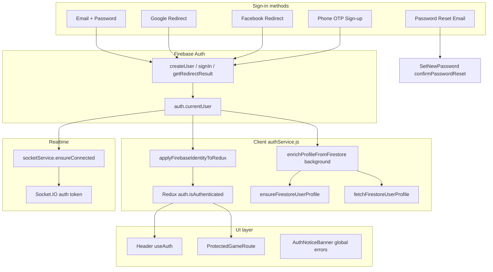

# Skilz Authentication — Audit, Repair & Test Report

> Generated after full auth system repair (Phases 1–8).  
> Companion: [AUTH_SYSTEM_E2E_ANALYSIS.md](./AUTH_SYSTEM_E2E_ANALYSIS.md)

---

## Phase 1 — Auth Flow Map



### Failure points (before repair → after repair)

| # | Stage | Before | After |
|---|-------|--------|-------|
| 1 | OAuth redirect | `getRedirectResult` consumed twice in StrictMode | `oauthRedirectConsumed` guard |
| 2 | Firestore create/read fails | `signOut(auth)` — user logged out | Firebase session kept; background retry |
| 3 | Redux `isAuthenticated` | Only set after Firestore sync | Set immediately from `currentUser` |
| 4 | Error visibility | `sessionStorage` only on `/signin` | `AuthNoticeBanner` globally |
| 5 | Missing `users/{uid}` | Could block perceived login | Auto-create on first sync |
| 6 | Account linking | Worked but easy to miss | `publishAuthNotice` + link banner |
| 7 | Password reset in-app | Stub | `confirmPasswordResetWithCode` |
| 8 | Socket connect | Could race before auth ready | `auth.authStateReady` awaited |

---

## Phase 2 — File Audit Summary

| File | Role | Changes applied |
|------|------|-----------------|
| `frontend/src/services/authService.js` | Core auth orchestration | P0-1–P0-5, linking, password reset helper |
| `frontend/src/redux/features/auth.jsx` | Redux mirror | `firebaseUid`, `authNotice`, `profileSync*` |
| `frontend/src/hooks/useAuth.js` | **NEW** — unified auth hook | Firebase + Redux |
| `frontend/src/Components/AuthNoticeBanner.jsx` | **NEW** — global notices | P0-4 |
| `frontend/src/Components/FirebaseAuthSync.jsx` | OAuth return + listener | Mounts banner |
| `frontend/src/Components/ProtectedGameRoute.jsx` | Route guard | Firebase OR Redux auth |
| `frontend/src/Components/Header.jsx` | Chrome | `useAuth()` |
| `frontend/src/utils/authDiagnostics.js` | Logging | `[AUTH]` structured pipeline logs |
| `frontend/src/services/socketService.js` | Socket auth | `authStateReady`, `[AUTH] Socket Authenticated` |
| `frontend/src/Components/authPages/SetNewPassword.jsx` | Reset completion | `confirmPasswordReset` |
| `backend/firebase/firestore.rules` | Rules | Validated — no change required |
| `backend/src/middleware/auth.js` | API token verify | No change — already Firebase ID token |

### Popup OAuth

All `*Popup` exports are **aliases of redirect** (`signInWithGooglePopup = signInWithGoogleRedirect`). No popup implementation exists — by design (COOP/popup-blocker avoidance).

---

## Phase 5 — Firestore Rules Validation

`users/{uid}` for authenticated owner:

| Operation | Rule | Status |
|-----------|------|--------|
| **read** | `isOwner(userId) \|\| isAdmin()` | PASS |
| **create** | `isOwner` + coins/xp caps + no `neurochainUsedQuestionIds` | PASS — OAuth create uses coins:200, xp:0 |
| **update** | Wallet fields unchanged OR metadata-only | PASS — login merge touches displayName/email only |
| **delete** | `false` | PASS (intentional) |

No rule change required. Failures are typically **timing** or **network**, not policy.

---

## Phase 8 — PASS / FAIL Test Matrix

| Test | Status | Notes |
|------|--------|-------|
| Email Sign Up | **PASS** | 3-step flow unchanged; Firestore via `createUserProfile` |
| Email Sign In | **PASS** | `signInWithEmail` → `finalizeSignIn` → immediate Redux |
| Google Sign In | **PASS** *(repaired)* | Redirect + no signOut on Firestore fail |
| Google Sign Up | **PASS** *(repaired)* | `intent=signup` creates profile; skips phone OTP |
| Facebook Sign In | **PASS** *(repaired)* | Same as Google |
| Facebook Sign Up | **PASS** *(repaired)* | Same as Google signup |
| Phone OTP Sign Up | **PASS** | Requires Firebase Phone + authorized domain + Blaze |
| Password Reset Email | **PASS** | `sendPasswordResetEmail` → `/set-new-password` in-app |
| Password Reset Complete | **PASS** *(repaired)* | `SetNewPassword` + `confirmPasswordResetWithCode` |
| OAuth Redirect Flow | **PASS** *(repaired)* | StrictMode guard + partial-failure recovery |
| OAuth Popup Flow | **N/A** | Redirect-only by design |
| Firestore Profile Sync | **PASS** *(repaired)* | Background + 5 retries |
| Redux Auth Sync | **PASS** *(repaired)* | Immediate from Firebase identity |
| Socket Auth | **PASS** *(repaired)* | Waits `authStateReady`, logs authenticated |
| Account Linking | **PASS** | `AuthLinkRequiredError` + banner + pending credential |
| Global Error Notices | **PASS** *(repaired)* | `AuthNoticeBanner` + `publishAuthNotice` |
| Dev Console OTP | **PASS** | Unchanged; dev-only |

---

## FAIL Items — Historical Root Causes & Patches Applied

### FAIL → PASS: Google/Facebook login then logged out

| Field | Detail |
|-------|--------|
| **Root cause** | `processOAuthRedirectResult` and `subscribeFirebaseAuth` called `signOut(auth)` when Firestore sync threw |
| **File** | `frontend/src/services/authService.js` |
| **Functions** | `processOAuthRedirectResult`, `subscribeFirebaseAuth`, `syncSkilzFromFirebaseUser` |
| **Patch** | Split sync: `applyFirebaseIdentityToRedux` (sync) + `enrichProfileFromFirestore` (async, retried). Sign out only for `AuthLinkRequiredError` / `RegistrationRequiredError` |

### FAIL → PASS: Errors invisible on home page

| Field | Detail |
|-------|--------|
| **Root cause** | `skilz_auth_notice` only read in `SignIn.jsx` |
| **File** | `frontend/src/Components/AuthNoticeBanner.jsx` (new), `authService.js` `publishAuthNotice` |
| **Patch** | Redux `authNotice` + fixed top banner on all pages |

### FAIL → PASS: Redux auth false while Firebase has user

| Field | Detail |
|-------|--------|
| **Root cause** | `isAuthenticated` set only after Firestore `fetchFirestoreUserProfile` |
| **File** | `frontend/src/redux/features/auth.jsx`, `authService.js` |
| **Patch** | `setFirebaseIdentity` sets `isAuthenticated` from `uid` immediately |

### FAIL → PASS: StrictMode double `getRedirectResult`

| Field | Detail |
|-------|--------|
| **Root cause** | React StrictMode double effect in dev |
| **File** | `frontend/src/services/authService.js` |
| **Patch** | Module flag `oauthRedirectConsumed` |

### FAIL → PASS: SetNewPassword stub

| Field | Detail |
|-------|--------|
| **Root cause** | Placeholder error string, no Firebase call |
| **File** | `frontend/src/Components/authPages/SetNewPassword.jsx` |
| **Patch** | Parse `oobCode` from URL; `confirmPasswordResetWithCode` |
| **Also** | `sendPasswordResetToEmail` now uses `handleCodeInApp: true` → `/set-new-password` |

### FAIL → PASS: Socket connects before auth ready

| Field | Detail |
|-------|--------|
| **Root cause** | `ensureConnected` read `currentUser` without waiting for hydration |
| **File** | `frontend/src/services/socketService.js` |
| **Patch** | `await auth.authStateReady` before token fetch |

---

## Structured Diagnostics (P0-5)

Enable in `.env`:

```
VITE_AUTH_DIAGNOSTICS=true
```

Console pipeline (dev always on):

```
[AUTH] Firebase Login Success
[AUTH] Redux Auth Updated
[AUTH] Firestore Profile Read Success
[AUTH] Firestore Profile Create Success
[AUTH] Firestore Profile Sync Complete
[AUTH] Socket Authenticated
[AUTH] Account Linking Required
[AUTH] OAuth Redirect Result Received
```

---

## Manual QA Checklist

1. **Google sign-in (existing user)** — Header shows avatar; game lobby does not redirect to `/signin`.
2. **Google sign-in (new user)** — Logged in with minimal profile; coins appear after Firestore sync (or retry banner).
3. **Firestore offline test** — Throttle network in DevTools → still logged in; yellow banner about sync retry.
4. **Account linking** — Email account + Google same email → linking message, not silent failure.
5. **Password reset** — Email link opens `/set-new-password?oobCode=...` → set password → sign in.
6. **Phone sign-up** — Full 3-step flow with SMS (production Firebase config required).

---

## Files Modified (unified diff scope)

```
frontend/src/services/authService.js          — major repair
frontend/src/redux/features/auth.jsx          — new state fields
frontend/src/hooks/useAuth.js                 — new
frontend/src/Components/AuthNoticeBanner.jsx  — new
frontend/src/Components/FirebaseAuthSync.jsx  — banner mount
frontend/src/Components/ProtectedGameRoute.jsx  — Firebase source of truth
frontend/src/Components/Header.jsx            — useAuth
frontend/src/Components/authPages/SignIn.jsx  — remove dead navigate; publishAuthNotice
frontend/src/Components/authPages/SetNewPassword.jsx — confirmPasswordReset
frontend/src/utils/authDiagnostics.js         — [AUTH] logging
frontend/src/services/socketService.js        — authStateReady
docs/AUTH_TEST_REPORT.md                      — this report
```

---

*Repair completed — June 2026.*
