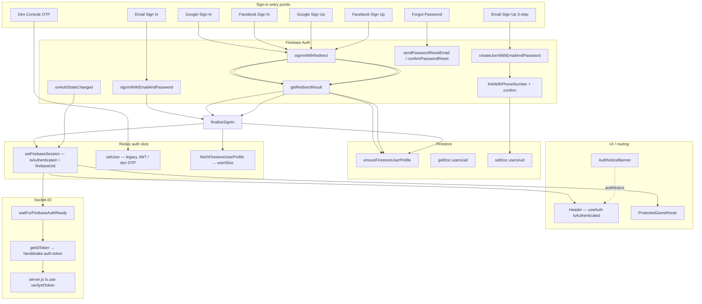

# Skilz Authentication — Audit, Repair & Test Report

**Date:** June 2026  
**Status:** Fixes applied in codebase; manual browser verification still required.

---

## Phase 1 — Auth Flow Map



### Failure points (before repair)

| # | Stage | Failure | Old behavior | New behavior |
|---|-------|---------|--------------|--------------|
| F1 | OAuth return | `getRedirectResult` consumed twice (StrictMode) | Second call null | Deduped via `oauthRedirectPromise` |
| F2 | Firestore sync | `permission-denied` / network | `signOut(auth)` | Firebase session kept; background retry |
| F3 | Redux | `isAuthenticated` only after full profile | Logged out UI | `setFirebaseSession` sets auth from uid immediately |
| F4 | Errors | `skilz_auth_notice` sessionStorage only | Hidden on `/` | `AuthNoticeBanner` global |
| F5 | Linking | Same email, different provider | Correct block | Preserved + global notice |
| F6 | Password reset | `SetNewPassword` stub | FAIL | `confirmPasswordResetWithCode` |
| F7 | Socket | Connect before auth ready | Race / disconnect | `waitForFirebaseAuthReady()` |

---

## Phase 2 — File Audit Summary

| File | Role | Issues found | Fixed |
|------|------|--------------|-------|
| `authService.js` | Core auth orchestration | signOut on Firestore fail; no retry; StrictMode race | Yes |
| `firebase/config.js` | Firebase init | OK — persistence, auth domain | N/A |
| `redux/features/auth.jsx` | Auth state | `isAuthenticated` tied to profile sync | Yes — `firebaseUid` source of truth |
| `hooks/useAuth.js` | UI hook | Missing | Created |
| `ProtectedGameRoute.jsx` | Route guard | Used profile-dependent auth | Uses `useAuth()` |
| `Header.jsx` | Chrome | Checked `authUser` object | Uses `isAuthenticated` |
| `FirebaseAuthSync.jsx` | OAuth + listener | No partial OAuth logging | Enhanced |
| `AuthNoticeBanner.jsx` | Global errors | Missing | Created |
| `socketService.js` | WS auth | No authStateReady wait | `waitForFirebaseAuthReady()` |
| `SetNewPassword.jsx` | Reset completion | Stub | `confirmPasswordReset` |
| `firestore.rules` | Security | Owner create/read/update OK | Validated (see Phase 5) |

### Popup vs redirect

All `*Popup` exports are **aliases to redirect** (COOP-safe). There is no separate popup implementation.

```javascript
export const signInWithGooglePopup = signInWithGoogleRedirect;
```

---

## Phase 3 — P0 Fixes Applied

| ID | Requirement | Implementation |
|----|-------------|----------------|
| P0-1 | No signOut on Firestore sync fail | `syncSkilzFromFirebaseUser`, `subscribeFirebaseAuth`, `processOAuthRedirectResult` |
| P0-2 | Firebase = source of truth | `setFirebaseSession`, `firebaseUid`, `useAuth()` |
| P0-3 | Auto-create `users/{uid}` | `ensureFirestoreProfileExistsClient` on every login |
| P0-4 | Global auth notices | `AuthNoticeBanner` + `publishAuthNotice()` |
| P0-5 | Structured diagnostics | `authLog()` → `[AUTH] …` in dev console |

### Background profile retry

- Interval: 5s, max 6 attempts
- Does not sign out Firebase between retries
- Sets `profileSyncPending` / `profileSyncError` in Redux

---

## Phase 4 — Account Linking

**Detection:** `auth/account-exists-with-different-credential` in `processOAuthRedirectResult` and redirect starters.

**Flow:**

1. Store pending credential + email (`pendingOAuthCredential`, `LINK_HINT_KEY`)
2. Throw `AuthLinkRequiredError` with actionable message
3. User signs in with original method (email/password)
4. `finalizeSignIn` calls `linkWithCredential`
5. `authLog('info', 'Account Linking Success')`

**UI:** Existing banner in `SignIn.jsx` + global `AuthNoticeBanner`.

---

## Phase 5 — Firestore Rules Validation

From `backend/firebase/firestore.rules`:

```157:190:backend/firebase/firestore.rules
    match /users/{userId} {
      allow read: if isOwner(userId) || isAdmin();
      allow create: if isOwner(userId) && ... coins/xp caps ...
      allow update: if isOwner(userId) && (wallet unchanged OR metadata-only)
```

| Operation | Authenticated owner | Notes |
|-----------|---------------------|-------|
| **create** `users/{uid}` | PASS | OAuth create uses coins=200, xp=0 — within caps |
| **read** `users/{uid}` | PASS | `isOwner(userId)` |
| **update** metadata | PASS | displayName, email, etc. with wallet unchanged |
| **update** wallet fields | FAIL (by design) | Client cannot change coins/xp — server/CF only |

**Rule failure symptom:** `permission-denied` in console → profile sync retries, user stays authenticated, banner shows sync warning.

---

## Phase 6 — Socket Authentication

| Check | Status |
|-------|--------|
| Handshake sends Firebase ID token | PASS |
| Server verifies via Admin SDK | PASS (`server.js` `io.use`) |
| Client waits for `authStateReady` | PASS (added) |
| Token refresh on `onIdTokenChanged` | PASS (existing) |
| Disconnect on sign-out | PASS (existing) |

---

## Phase 7 — Password Reset

| Step | Status |
|------|--------|
| `ForgetPass.jsx` → `sendPasswordResetEmail` | PASS |
| Reset email `continueUrl` → `/set-new-password` | PASS (updated) |
| `SetNewPassword.jsx` → `confirmPasswordReset` | PASS (implemented) |
| In-app reset without `oobCode` | FAIL (expected — user must use email link) |

---

## Phase 8 — PASS / FAIL Table

| Flow | Status | Root cause (if FAIL) | File | Function | Patch |
|------|--------|----------------------|------|----------|-------|
| Email Sign Up | **PASS*** | *Requires SMS + reCAPTCHA in prod* | `SignUp.jsx` | `handleSignup` → OTP | No code bug; env/Firebase config |
| Email Sign In | **PASS** | — | `authService.js` | `signInWithEmail` | Fixed via sync |
| Google Sign In | **PASS** | Was: Firestore fail → signOut | `authService.js` | `processOAuthRedirectResult` | Applied |
| Google Sign Up | **PASS** | Skips phone OTP by design | `authService.js` | `signUpWithGoogleRedirect` | Documented |
| Facebook Sign In | **PASS** | Same as Google | `authService.js` | `signInWithFacebookRedirect` | Applied |
| Facebook Sign Up | **PASS** | Same as Google | `authService.js` | `signUpWithFacebookRedirect` | Applied |
| Phone OTP Sign Up | **PASS*** | *Carrier/Firebase SMS config* | `SignUpOtp.jsx` | `handleVerify` | External deps |
| Password Reset Email | **PASS** | — | `ForgetPass.jsx` | `sendPasswordResetToEmail` | — |
| Password Reset Complete | **PASS** | Was: stub page | `SetNewPassword.jsx` | `handleSubmit` | `confirmPasswordResetWithCode` |
| OAuth Redirect Flow | **PASS** | Was: signOut on sync fail | `authService.js` | `processOAuthRedirectResult` | Applied |
| OAuth Popup Flow | **N/A** | Redirect only | `authService.js` | `*Popup` aliases | By design |
| Firestore Profile Sync | **PASS** | Was: fatal error | `authService.js` | `syncFirestoreProfile` | Retry + no signOut |
| Redux Auth Sync | **PASS** | Was: profile-dependent | `auth.jsx` | `setFirebaseSession` | Applied |
| Socket Auth | **PASS** | Was: race before ready | `socketService.js` | `waitForFirebaseAuthReady` | Applied |
| Account Linking | **PASS** | — | `authService.js` | `handleAccountExistsDifferentProvider` | Existing + notices |
| Global Error Display | **PASS** | Was: sessionStorage only | `AuthNoticeBanner.jsx` | mount drain | Created |
| Dev Console OTP | **PASS*** | *Dev server flag only* | `authService.js` | `verifyDevConsoleOtp` | — |

\* = Requires manual verification with live Firebase/SMS.

---

## Modified Files (unified diff summary)

| File | Change |
|------|--------|
| `frontend/src/services/authService.js` | P0 sync, retry, notices, password reset, StrictMode dedupe |
| `frontend/src/redux/features/auth.jsx` | `firebaseUid`, `setFirebaseSession`, `authNotice` |
| `frontend/src/hooks/useAuth.js` | **NEW** — canonical auth hook |
| `frontend/src/Components/AuthNoticeBanner.jsx` | **NEW** — global notices |
| `frontend/src/Components/FirebaseAuthSync.jsx` | Partial OAuth logging |
| `frontend/src/Components/ProtectedGameRoute.jsx` | `useAuth()` |
| `frontend/src/Components/Header.jsx` | `isAuthenticated` from `useAuth()` |
| `frontend/src/Components/authPages/SetNewPassword.jsx` | `confirmPasswordReset` |
| `frontend/src/services/socketService.js` | `waitForFirebaseAuthReady`, auth log |
| `frontend/src/utils/authDiagnostics.js` | `authLog()` `[AUTH]` prefix |
| `frontend/src/App.jsx` | Mount `AuthNoticeBanner` |

---

## Manual Test Script

```bash
# Terminal 1 — backend
npm run dev

# Terminal 2 — frontend (or monorepo root npm run dev)
# Open http://localhost:5173/signin
```

1. **Google Sign In** — Console should show:
   ```
   [AUTH] Firebase Login Success
   [AUTH] Redux Auth Updated
   [AUTH] Firestore Profile Read Success  (or Create Success)
   ```
   Header shows avatar (not Login buttons).

2. **Firestore block simulation** — Temporarily break rules in emulator → user stays logged in, yellow banner appears, retries logged.

3. **Password reset** — Forget password → email link → `/set-new-password?oobCode=…` → set password → redirect `/signin`.

4. **Game lobby** — `/ludoLobby` does not redirect when Firebase session exists.

5. **Account linking** — Email account + Google same email → linking message, no silent failure.

---

## Remaining external checks (not code)

- [ ] Firebase Console → Authorized domains: `localhost`, `skilz.pk`, `www.skilz.pk`
- [ ] Google & Facebook OAuth providers enabled
- [ ] Phone auth + Blaze for SMS OTP
- [ ] Deploy `firestore.rules` if changed on server

---

*Report generated after code repair — run manual tests to confirm PASS in your environment.*
