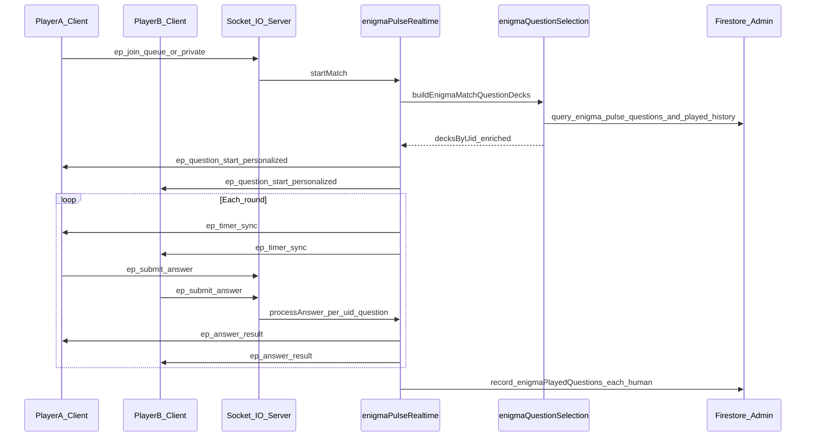

## Sequence IQ (riddle_sequence)

Sequence IQ is wired as a dedicated EnigmaPulse mode key: `riddle_sequence`.

### Runtime flow

1. Lobby selects `Sequence IQ` and sends queue payload with `gameKey: "riddle_sequence"`.
2. Matchmaking uses existing Enigma realtime service and falls back to bot after queue timeout.
3. Room route for Sequence IQ is `/enigmaPulse/sequence/:roomId`.
4. Questions are fetched from Firestore `questions` bank filtered by:
   - `gameType = enigma_pulse`
   - `type = riddle_sequence` (or legacy `sequence`)
   - category, difficulty, active
5. Match settles rewards idempotently via room+uid transaction key.

### Timer and rewards

- Difficulty timers:
  - easy: 60s
  - medium: 45s
  - hard: 30s
- Match rewards:
  - winner: +20 coins, +40 XP
  - loser: +10 coins, +20 XP

### Question payload (supported)

Required fields:
- `question`, `option1..4`, `correctIndex`, `category`, `difficulty`, `type=riddle_sequence`

Optional fields:
- `sequence` (array or delimiter string)
- `patternKind`
- `hint`
- `explanation`
# EnigmaPulse — Game Flow, Question Pipeline, and Firestore Integration

This document describes how **EnigmaPulse** works end-to-end in this repository: lobby and routing, realtime match flow, how questions are **generated and loaded** (important: not on the client), and how to serve questions from **Firestore** including an **admin dashboard** upload path. It is based on the current code under `frontend/src/games/EnigmaPulse/` and `backend/src/services/enigmaPulse*`.

---

## 1. Scope: What “EnigmaPulse” is in this codebase

- **Routes (frontend)**  
  - Lobby: `/enigmaPulseLobby` (`App.jsx` → `EnigmaPulseLobby.jsx`)  
  - Match room: `/enigmaPulse/game/:roomId` (`EnigmaPulseGameRoom.jsx`)

- **Transport**  
  - Gameplay is **Socket.IO** on the same connection pattern as other games (`../mathRush/lib/socket.js`).  
  - Event names are centralized in `shared/enigmaPulse/constants.js` (`EnigmaPulseEvents`, `ENIGMA_PULSE` tuning constants).

- **Authority**  
  - **The server** owns match state, timers, scoring, and which question is active. The browser only renders what the server sends and emits player actions (answer, hint, skip, sync).

---

## 2. Lobby: modes, payloads, and related games

`EnigmaPulseLobby.jsx` is a **hub**:

1. **Auth** — `ensureGameUserFromAuth()`; unauthenticated users go to `/signin`.
2. **Socket** — `connectSocket()` + `ensureSocketConnected()`.
3. **Invite deep link** — Query `?inviteId=` triggers `ep_accept_invite_link` with user display metadata.

### 2.1 Play modes (EnigmaPulse socket queue)

From `modes/modeRegistry.js`, the selectable **EnigmaPulse** games include:

| `gameKey`          | UI title        | Notes |
|-------------------|-----------------|-------|
| `riddle_classic`  | Classic Riddle  | Uses EnigmaPulse Socket.IO flow described below. |
| `riddle_sequence` | Sequence        | **Still resolves to the same engine as classic** on the server (`engines/registry.js`). NeuroChain is used when user picks Practice/1v1 under this tile (see below). |

Practice vs 1v1 builds payloads via:

- `buildPracticeQueuePayload` → `soloBot: true`
- `buildOneVsOneQueuePayload` → `soloBot: false`

Emitted event: **`ep_join_queue`** with `displayName`, `photoURL`, `category`, `difficulty`, `gameKey`, `xp`, `soloBot`.

### 2.2 Redirects to other products

The lobby intentionally **does not** keep all “games” inside EnigmaPulse sockets:

- **NeuroChain** (`riddle_sequence` in mode modal): Cloud Functions API (`callNeuroChainStartPractice`, `callNeuroChainEnqueue1v1`, …) → navigates to `/neurochain/game/...`.
- **Cognitive Arena** (`logic_grid` is commented out in `modeRegistry.js` but code paths still reference it): `callCognitiveStartPractice` / queue → `/cognitive/game/...`.

Only **`riddle_classic`** (and the socket branch for sequence key when not redirected) uses **`ep_*`** events and `EnigmaPulseGameRoom`.

### 2.3 Matchmaking behavior (server)

From `backend/src/services/enigmaPulseRealtime.js`:

- Queue entries are matched on **`category`, `difficulty`, `gameKey`** and **XP bucket** (`rankBucket`, within `ENIGMA_PULSE.RANK_BUCKET_MAX_DELTA`).
- **Practice** (`soloBot: true`): immediately pairs the player with a **bot** (`ep_bot_*` uid).
- **1v1**: waits up to **`ENIGMA_PULSE.MATCHMAKING_TIMEOUT_MS`** (12s); if no pair, emits error `QUEUE_TIMEOUT`.
- **Private room**: host `ep_create_private`, guest `ep_join_private` → then `startMatch` loads questions and begins play.

---

## 3. Match lifecycle (server-driven)

Constants (`shared/enigmaPulse/constants.js`) include:

- **`QUESTION_COUNT`**: 12 (target length of a full match; short pools can yield fewer — see §5).
- **`QUESTION_SECONDS`**: 15 per question.
- **`MAX_ATTEMPTS_PER_QUESTION`**: 2 (frontend mirrors this in UI copy).
- **Economy / ledger hooks**: entry fee and rewards are applied in `endMatch` via Firestore helpers (`recordTransaction`, `upsertLeaderboardEntry`, `recordRoomSummary`) when Admin SDK is configured.

### 3.1 Starting a match

`startMatch(p1, p2, matchType, gameKey)`:

1. Resolves **`resolveEnigmaEngine(gameKey)`** ( **`RiddleEngine`** validation/scoring only; decks are loaded separately).
2. Calls **`buildEnigmaMatchQuestionDecks`** (`backend/src/services/enigmaPulse/enigmaQuestionSelection.js`):
   - Loads candidates from **Firestore** (`gameType == enigma_pulse`, lobby **`category` / `difficulty`**) and/or **local JSON** depending on **`ENIGMA_PULSE_QUESTION_SOURCE`** (`auto` / `firestore` / `local`).
   - Builds **two disjoint decks** of length **`QUESTION_COUNT`** (or shorter if the pool is small): one deck per player. **`acceptedAnswers` / normalization** are applied via **`enrichQuestionForPlay`** inside that builder.
   - Excludes questions already recorded under **`users/{uid}/enigmaPlayedQuestions`** (see §5.4). If both decks cannot be filled, history for that category+difficulty is **reset once** (similar idea to Trivia’s replay loop), then selection retries.
3. Builds `match` with **`questionsByUid`** (full server-side rows) and **`clientQuestionsByUid`** (sanitized per-player payloads from **`normalizeQuestionForClient`**).
4. Joins sockets to `roomId`, emits **`ep_match_found`**, then **`startQuestion`**.

### 3.2 Per-question loop

`startQuestion(roomId)`:

- Resets player flags (`answered`, `attemptsLeft`, hints, skips).
- Sets **`deadlineMs`** = now + 15s.
- Emits **`ep_question_start`** **once per player socket** (same **`questionIndex`**, **different `question`** in each payload), then **`ep_timer_sync`** to the room (timer stays shared).
- Schedules **bot** answer if applicable (`scheduleBotAnswer`).

Resolution **`resolveQuestion`**:

- Emits **`ep_answer_result`** with per-player correctness and scores.
- Advances `questionIndex`; if past **`questionTarget`** (derived from actual loaded question count), **`ep_match_end`**; else **`ep_next_question`** then next `startQuestion`.

### 3.3 Player actions (socket → server)

| Client emit | Purpose |
|-------------|---------|
| `ep_submit_answer` | Validates via `validateSubmitPayload`; server **`processAnswer`** uses **`match.engine.validateAnswer`** (text + optional legacy index). |
| `ep_use_hint` | Server sends hint preview derived from correct option / accepted answers (`getHintPreview`). |
| `ep_skip_question` | Marks skip; may advance round when all players finished. |
| `ep_request_sync_state` | Receives **`ep_sync_state`** with **personalized** state (`question` is **your** deck entry). |
| `ep_reconnect_user` | Re-binding socket to in-progress match; grace timer on disconnect. |

Payload validation rules live in `shared/enigmaPulse/validators.js`.

---

## 4. Question “generation” — what actually happens

There is **no generative AI inside the live Socket match path**. Deck assembly is deterministic:

### 4.0 Match runtime path (authoritative)

1. **`buildEnigmaMatchQuestionDecks`** loads candidates (Firestore **`gameType: enigma_pulse`** + lobby **`category` / `difficulty`**, or local JSON as configured).
2. Rows must have **`question` / `text`** (Firestore admin stores **`question`**), **four `options`**, **`correctIndex` 0–3**, optional **`acceptedAnswers`** / **`normalizedAnswer`** for typed answers.
3. Two **non-overlapping** decks are assigned to the two player UIDs; **`correctIndex` never leaves the server**.
4. After **`ep_match_end`**, each human player’s **full deck question IDs** are appended under **`users/{uid}/enigmaPlayedQuestions`** (`recordEnigmaPlayedQuestions`) so future matches prefer unseen items until history is reset.

### 4.0b Legacy pack loader (still in repo)

**`loadEnigmaPulseQuestionPack`** (`questionProvider.js`) + **`RiddleEngine.generateQuestions`** remain useful for **tests** and any tooling that expects a **single shared** deck; live multiplayer EnigmaPulse **`startMatch`** no longer calls that path.

### 4.1 Offline / batch AI generation (optional)

`backend/scripts/enigmaPulse/generateQuestions.js` calls **`generateQuestionBatch`** + **`persistQuestionBatch`** (`aiBatchGenerator.js`):

- Uses **`OPENAI_API_KEY`** and **`ENIGMA_PULSE_AI_PROVIDER`** (currently `openai` only).
- Produces documents compatible with the same **`questions`** collection schema used at runtime (`buildPersistDoc`).

This is **operations tooling**, not the live player request path.

### 4.2 Local question bank

- Default path: `backend/src/services/enigmaPulse/data/enigmaPulseQuestions.json`.
- Override with **`ENIGMA_PULSE_QUESTIONS_PATH`** (absolute or cwd-relative).
- Rows without `id` get a stable hash id **`epq_*`** (`stableLocalQuestionId`).

---

## 5. Firestore: schema, reads, and played history

### 5.1 EnigmaPulse read path (`enigmaQuestionSelection.js`)

- Collection: **`questions`**
- Match queries use **`gameType == 'enigma_pulse'`** plus **`category`**, **`difficulty`**, **`active == true`** (same category strings as **`shared/enigmaPulse/categories.js`**, used by the lobby).
- Documents may store prompt text as **`question`** (admin path) or **`text`** (legacy batch script); runtime maps **`question ?? text`** → internal **`text`**.

Deploy **`backend/firebase/firestore.indexes.json`** updates so composite queries (stats, admin lists, runtime fetch) succeed.

### 5.2 Admin / Trivia documents (`firestoreQuestionAdmin.js`)

Trivia rows use **`gameType: 'trivia'`** (default when omitted on legacy docs for listing behavior). Enigma uploads must set **`gameType: 'enigma_pulse`** (CSV column, Excel column, or UI selector).

### 5.3 Write paths

| Path | Notes |
|------|------|
| Admin **`POST /api/admin/questions/bulk-csv`** / **`bulk-xlsx`** | Validates rows; writes **`question`**, **`options`**, **`correctIndex`**, **`gameType`**, **`questionHash`**, etc. |
| **`persistQuestionBatch`** (`aiBatchGenerator.js`) | Writes **`text`**, **`gameType: 'enigma_pulse'`**, plus options / aliases. |

### 5.4 Served-history (`enigmaPlayedHistory.js`)

Subcollection **`users/{uid}/enigmaPlayedQuestions/{questionDocId}`** stores **`playedAt`**, **`category`**, **`difficulty`**. It is **separate** from Trivia’s **`playedQuestions`** so IDs never collide across games. Oldest entries are pruned when count exceeds **500** per user.

---

## 6. Frontend vs server contract

### 6.1 Personalized payloads

`roomPayloadForUid(match, uid)` sets **`room.question`** from **`clientQuestionsByUid[uid][questionIndex]`**. **`normalizeQuestionForClient`** sends **`id`, `text`, `options` (four strings), `imageUrl`, `category`, `difficulty`**, and optional **`sequence`**. It **never** exposes **`correctIndex`** or raw solution lists beyond hint logic server-side.

`EnigmaPulseGameRoom.jsx` shows MCQ tiles when **`options`** exist; otherwise it falls back to typed answers.

### 6.2 “Sequence” game key

`riddle_sequence` still maps to the same validation engine as classic unless you add a dedicated generator.

### 6.3 Shared `questions` collection

Use **`gameType`** to separate **Trivia** vs **EnigmaPulse** documents. Runtime Enigma selection **always** filters **`gameType == 'enigma_pulse'`**.

---

## 7. Admin dashboard → Firestore → players

Implemented in **`frontend/src/admin/AdminQuestions.jsx`** and **`backend/src/routes/adminQuestionsRoutes.js`**.

### 7.1 CSV / Excel columns

Use the same columns as Trivia, plus optional **`gameType`**:

`category`, `difficulty`, `question`, `option1`, `option2`, `option3`, `option4`, `correctIndex`, optional `tags`, optional `gameType` (`trivia` | `enigma_pulse`).

For EnigmaPulse, **`category`** must be one of **`shared/enigmaPulse/categories.js`**. The UI **preview upload** can apply default **`gameType`** when the column is omitted.

Endpoints:

- **`POST /api/admin/questions/bulk-csv`** — multipart field **`file`**
- **`POST /api/admin/questions/bulk-xlsx`** — first worksheet, header row → same lowercase keys as CSV

### 7.2 Runtime configuration

- **`ENIGMA_PULSE_QUESTION_SOURCE`**: **`auto`** | **`firestore`** | **`local`**
- Firebase Admin must be configured for Firestore reads & played-history writes.

### 7.3 Pool sizing

Each match consumes **two disjoint decks** of length **`QUESTION_COUNT`** (default **12**). Budget **at least ~24 eligible Firestore docs** per **`(category, difficulty)`** before replay / history reset kicks in (more if you want longer streaks without repetition).

---

## 8. End-to-end sequence diagram (conceptual)



---

## 9. File map (quick reference)

| Area | Path |
|------|------|
| Lobby UI | `frontend/src/games/EnigmaPulse/EnigmaPulseLobby.jsx` |
| Room UI | `frontend/src/games/EnigmaPulse/EnigmaPulseGameRoom.jsx` |
| Mode payloads | `frontend/src/games/EnigmaPulse/modes/*.js` |
| Shared constants | `shared/enigmaPulse/constants.js`, `shared/enigmaPulse/validators.js` |
| Socket handlers | `backend/src/services/enigmaPulseRealtime.js` |
| Match deck assembly | `backend/src/services/enigmaPulse/enigmaQuestionSelection.js`, `enigmaPlayedHistory.js` |
| Legacy single-deck loader | `backend/src/services/enigmaPulse/questionProvider.js` |
| Firestore IO (legacy helper) | `backend/src/services/enigmaPulse/firestoreRepos.js` |
| Admin question API | `backend/src/services/firestoreQuestionAdmin.js`, `backend/src/routes/adminQuestionsRoutes.js` |
| Lobby category source of truth | `shared/enigmaPulse/categories.js` |
| Engine | `backend/src/services/enigmaPulse/engine/RiddleEngine.js`, `engine/AnswerValidator.js` |
| Local bank | `backend/src/services/enigmaPulse/localQuestionBank.js`, `data/enigmaPulseQuestions.json` |
| AI batch import | `backend/src/services/enigmaPulse/aiBatchGenerator.js`, `backend/scripts/enigmaPulse/generateQuestions.js` |

---

This document reflects the repository behavior at authoring time. If you change lobby category strings, engine registry, or client payloads, update the corresponding sections and deployment notes together.

## 10. Syllogism Question Contract (Strict)

Syllogism mode is now enforced as game-specific content. For a question to be selectable in Syllogism gameplay, all of the following must be true:

- `gameType = enigma_pulse`
- `category = Syllogism`
- `type = syllogism`
- `difficulty = easy | medium | hard`
- `active = true`
- exactly four options and valid `correctIndex`

Any row that violates these constraints is rejected at admin validation or excluded by runtime selection.

### 10.1 Upload template for generators

```text
gameType,category,difficulty,type,question,option1,option2,option3,option4,correctIndex,tags,active
```

### 10.2 Runtime player payload shape

The server sends a sanitized per-player question payload:

```json
{
  "id": "question_doc_id",
  "text": "Syllogism prompt...",
  "options": ["A", "B", "C", "D"],
  "category": "Syllogism",
  "difficulty": "medium"
}
```

`correctIndex` never leaves the server; answer evaluation remains server-authoritative.
