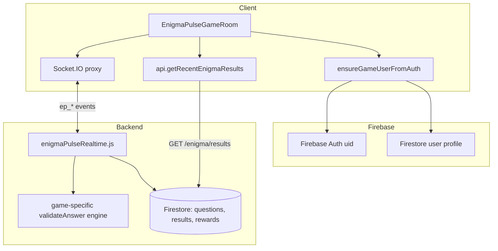
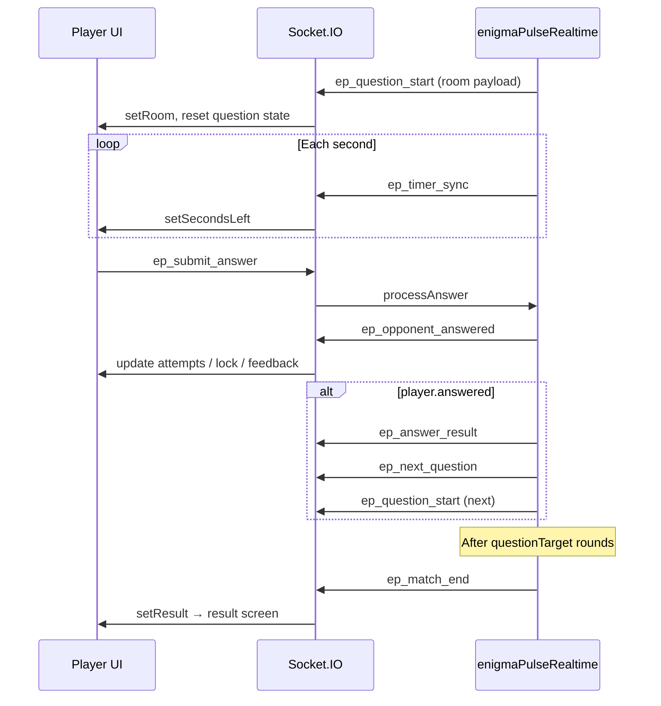

# EnigmaPulseGameRoom — Technical Reference

> **File:** `frontend/src/games/EnigmaPulse/EnigmaPulseGameRoom.jsx`  
> **Route:** `/enigmaPulse/game/:roomId` (protected by `ProtectedGameRoute`)  
> **Role:** Real-time multiplayer **in-match UI** for EnigmaPulse game modes that use the generic “game room” shell (not Syllogism or Sequence IQ, which have dedicated screens).

---

## 1. Purpose and scope

`EnigmaPulseGameRoom` is the client-side **match runtime** for EnigmaPulse. It:

1. Authenticates the player via Firebase (`ensureGameUserFromAuth`).
2. Connects to the shared Socket.IO layer used by MathRush (`connectSocket` / `ensureSocketConnected`).
3. Joins or reconnects to a server-side match identified by `roomId` from the URL.
4. Listens for server-driven game events (questions, timer, scores, match end).
5. Emits player actions (submit answer, hint, skip, sync).
6. Renders the live HUD, question surface (sequence or riddle text), MCQ tiles or text input, and post-match result screens.

### What this component does **not** own

| Concern | Handled elsewhere |
|--------|-------------------|
| Lobby, queue, invite creation | `EnigmaPulseLobby.jsx` |
| Pattern Recognition / Sequence IQ | `PatternRecognition.jsx` at `/enigmaPulse/sequence/:roomId` |
| Syllogism | `Syllogism.jsx` at `/enigmaPulse/syllogism` |
| Matchmaking deck build, scoring rules, timers | `backend/src/services/enigmaPulseRealtime.js` |
| Question bank / Firestore | Admin + `enigmaQuestionSelection.js` |

Lobby routing (`enigmaRouteForGame` in `EnigmaPulseLobby.jsx`) sends **pattern_recognition** to the sequence route and everything else in this table to `/enigmaPulse/game/:roomId`.

---

## 2. High-level architecture



**Stack alignment:** MERN-style API for REST (`api.js`), Firebase for identity/profile, Socket.IO for realtime match state, shared constants in `shared/enigmaPulse/`.

---

## 3. Entry paths (how players arrive)

| Source | Navigation | Socket behavior on mount |
|--------|------------|---------------------------|
| Lobby matchmaking / private room | `navigate('/enigmaPulse/game/:roomId', { state: { match } })` | `ep_reconnect_user`; **skips** `ep_join_private` if `location.state.match` is set |
| Direct URL `?matchId=` from lobby | `navigate('/enigmaPulse/game/:roomId')` | `ep_reconnect_user` + `ep_join_private` with `roomId`, `displayName`, `photoURL` |
| Wrong room redirect | `onMatchFound` → navigate to new `roomId` | Replaces history with new room |

**Important:** `location.state.match` is only used for:

- Skipping `ep_join_private` on init.
- Inferring `gameKey` before `room` exists (`gameKeyHint` → Word Cipher loading UI).

The component **does not** copy `location.state.match` into `room` state. The live room always comes from socket events (`ep_question_start`, `ep_sync_state`).

---


## 4. Constants and shared contracts

| Symbol | Location | Used for |
|--------|----------|----------|
| `MAX_ATTEMPTS_PER_QUESTION` (2) | Local + `ENIGMA_PULSE.MAX_ATTEMPTS_PER_QUESTION` | UI “Attempts” metric; server enforces same limit |
| `OPTION_LABELS` | Local `['A','B','C','D']` | MCQ tile labels |
| `EnigmaPulseEvents` | `shared/enigmaPulse/constants.js` | Canonical socket event names |
| `isPatternRecognitionGameKey` | `shared/enigmaPulse/gameKeys.js` | Title/kicker only in `roomDisplayMeta` (this route rarely serves pattern games) |
| `ENIGMA_PULSE.QUESTION_SECONDS` (15) | Shared constants | Timer bar assumes 15s (`progressPercent = secondsLeft / 15`) |

### `roomDisplayMeta(gameKey)` — UI branding

| `gameKey` | Title | Kicker |
|-----------|-------|--------|
| `word_cipher` | WORD CIPHER | Decode the hidden term |
| `pattern_recognition` / `riddle_sequence` | SEQUENCE IQ | Predict the next node |
| `logic_grid` | LOGIC MASTER | Find the missing pattern |
| default | LOGIC QUIZ | Choose the best answer |

---

## 5. React state model

| State | Type | Purpose |
|-------|------|---------|
| `gameUser` | `{ uid, displayName, photoURL, email? }` | Current player from Firebase + Firestore |
| `room` | Server room payload | `null` until first `QUESTION_START` or `SYNC_STATE` |
| `secondsLeft` | number | From `TIMER_SYNC`; default 15 |
| `result` | match end payload | When set, switches to result view |
| `submittedForQuestion` | boolean | Local lock after answer finalized for round |
| `answerText` | string | Free-text answer path |
| `localHint` | string | Hint text for this player |
| `opponentAnswered` | boolean | Opponent submitted for current round |
| `lastOutcome` | `{ correct, timedOut }` | Feedback for MCQ/text attempts |
| `submitPending` | boolean | In-flight submit until server responds |
| `selectedOption` | string | Which MCQ option was chosen |
| `recentResults` | array | Word Cipher only; REST after match end |

### Derived values (`useMemo` / inline)

- **`me`:** `room.players.find(p => p.uid === gameUser.uid)`
- **`gameKey`:** `room.gameKey` → fallback `gameKeyHint` → `'riddle_classic'`
- **`questionNumber`:** `questionIndex + 1`
- **`sequenceCells`:** `room.question.sequence` if array
- **`optionList`:** trimmed `room.question.options`; **`showMcqTiles`** when `length >= 4`
- **`progressPercent`:** timer bar width

---

## 6. Lifecycle and render phases

The component is a **state machine** with four top-level UI phases:

```mermaid
stateDiagram-v2
  [*] --> Loading: room === null
  Loading --> Playing: QUESTION_START or SYNC_STATE
  Playing --> Playing: NEXT_QUESTION
  Playing --> Results: MATCH_END
  Results --> [*]: navigate to lobby

  state Loading {
    [*] --> WordCipherConnecting: gameKeyHint === word_cipher
    [*] --> GenericSpinner: else
  }

  state Results {
    [*] --> WordCipherResult: gameKey === word_cipher
    [*] --> EnigmaPulseMatchResultView: else
  }
```



### Phase A — Bootstrap (`useEffect` #1, deps: `roomId`, `location.state?.match`, `navigate`)

1. `ensureGameUserFromAuth()` → redirect `/signin` if no user.
2. `setGameUser(u)`.
3. `connectSocket()` + `await ensureSocketConnected()`.
4. `socket.emit('ep_reconnect_user')` — re-associates socket with Firebase uid on server.
5. Unless `location.state?.match` exists:  
   `socket.emit('ep_join_private', { roomId, displayName, photoURL })`.

### Phase B — Loading (`room === null`)

- **Word Cipher:** `WordCipherConnecting` placeholder.
- **Other modes:** `<motionless>` “Connecting to room...” (`.ep-room-loading`).

Server must emit `ep_question_start` or client may call **Sync State** (`ep_request_sync_state`) from footer.

### Phase C — Active play (`room` set, `result` null)

Full stage UI: header (streak, round), timer HUD, question card, hints, MCQ and/or text answer, stats strip, progress dots, footer actions.

### Phase D — Match end (`result` set)

- **`word_cipher`:** `WordCipherResult` + `api.getRecentEnigmaResults({ gameKey: 'word_cipher', limit: 5 })`.
- **Other keys:** `EnigmaPulseMatchResultView` with `gameLabel` from `roomDisplayMeta`.

Both offer `onBackToLobby` → `navigate('/enigmaPulseLobby')`.

---

## 7. Socket event contract (instructions)

All listeners are registered in **useEffect #2** (deps: `gameUser?.uid`, `roomId`, `navigate`). Every handler filters by `payload.roomId === roomId` (except `onMatchFound` which redirects to another room).

### 7.1 Inbound (server → client)

| Event constant | String | Handler behavior |
|----------------|--------|------------------|
| `QUESTION_START` | `ep_question_start` | `setRoom(payload)`; reset per-question UI flags |
| `TIMER_SYNC` | `ep_timer_sync` | `setSecondsLeft(payload.secondsLeft)` |
| `ANSWER_RESULT` | `ep_answer_result` | Merge scores/streak/coins into `room.players`; set `lastOutcome` for self from `answerResults` |
| `NEXT_QUESTION` | `ep_next_question` | Bump `room.questionIndex`; reset question UI |
| `MATCH_END` | `ep_match_end` | `setResult(payload)` |
| `MATCH_FOUND` | `ep_match_found` | If different `roomId`, navigate replace to correct game URL |
| `SYNC_STATE` | `ep_sync_state` | Full `setRoom(payload)` — recovery |
| `OPPONENT_ANSWERED` | `ep_opponent_answered` | See §7.3 |
| `OPPONENT_USED_HINT` | `ep_opponent_used_hint` | If `uid === gameUser.uid`, `setLocalHint(hint)` |

#### `QUESTION_START` / room payload shape (from server `roomPayloadForUid`)

Typical fields the UI consumes:

```ts
{
  roomId: string;
  status: 'playing' | 'waiting' | 'preparing' | 'ended';
  gameKey: string;
  category: string;
  difficulty: string;
  questionIndex: number;
  totalQuestions: number;
  question: {
    id: string;
    text: string;
    options?: string[];      // up to 4; empty for text-input modes
    sequence?: (string|number)[];  // pattern / sequence display
    category?: string;
    hint?: string;           // server may strip; hint via USE_HINT
  };
  players: Array<{
    uid, displayName, photoURL,
    score, coinsEarned, streak,
    answered, attemptsLeft, isBot,
    powerUps: { fiftyFifty, skip, doublePoints }
  }>;
  deadlineMs?: number;
  currentTurnUid?: string;  
   // turn-based modes (Sequence IQ on other route)
}
```

#### `ANSWER_RESULT` — end-of-round settlement broadcast

Emitted when a question resolves (`timeout`, `turn_answered`, `skipped`). Updates leaderboard strip and sets `lastOutcome` if `timedOut` from `reason === 'timeout'`.

#### `OPPONENT_ANSWERED` — per-submit feedback

Two branches:

1. **`payload.uid === gameUser.uid` (my submit ack):**
   - Update `attemptsLeft`, `answered` on my player row.
   - `lastOutcome` from `payload.correct` if boolean.
   - If not `locked`: allow retry — clear `submittedForQuestion`, clear text/option on wrong answer.
   - If `locked`: `submittedForQuestion = true`.
   - Clear `submitPending` when uid matches.

2. **Else (opponent):** `setOpponentAnswered(true)`.

This pairs with server `processAnswer` in `enigmaPulseRealtime.js`, which emits `OPPONENT_ANSWERED` after each validation attempt and calls `resolveQuestion` when `player.answered` becomes true.

### 7.2 Outbound (client → server)

| User action | Emit | Payload |
|-------------|------|---------|
| Submit text answer | `EnigmaPulseEvents.SUBMIT_ANSWER` (`ep_submit_answer`) | `{ roomId, questionId, questionIndex, answerText }` |
| Tap MCQ option | same | `answerText` = option string |
| Request Hint | `'ep_use_hint'` * | `{ roomId, questionIndex }` |
| Skip | `'ep_skip_question'` * | `{ roomId, questionIndex }` |
| Sync State | `'ep_request_sync_state'` * | `{ roomId }` |
| Init reconnect | `'ep_reconnect_user'` * | (none) |
| Join private room | `'ep_join_private'` * | `{ roomId, displayName, photoURL }` |

\*These three use **string literals** instead of `EnigmaPulseEvents` constants. Values match `shared/enigmaPulse/constants.js` today; prefer constants for consistency (as in `Syllogism.jsx` / `PatternRecognition.jsx`).

#### Submit guards (client-side)

Both `submitSelectedAnswer` and `submitOption` bail out if:

- No `room.question` or `result` already set.
- `submittedForQuestion` or `submitPending`.
- Empty trimmed text (text path only).

They set `submitPending = true` before emit.

#### Server-side submit pipeline (authoritative)

`enigmaPulseRealtime.js` → `processAnswer`:

1. Match playing, before `deadlineMs`.
2. `questionIndex` and `questionId` must match.
3. Turn check: `currentTurnUid` if set (mainly Sequence IQ).
4. Up to **2 attempts** (`MAX_ATTEMPTS_PER_QUESTION`).
5. `match.engine.validateAnswer({ question, answerText, selectedIndex })`.
6. Correct → score + streak + coins; `answered = true`.
7. Wrong → decrement `attemptsLeft`; lock when exhausted.
8. Emit `OPPONENT_ANSWERED`; if locked, `resolveQuestion`.

---

## 8. Question presentation logic

### Sequence vs riddle text

```
if (sequenceCells.length > 0)
  render ep-sequence-line (cells, "?" styled as mystery slot)
else
  render room.question.text as ep-riddle-text
```

Kicker text: fixed “Predict the next node…” when sequence present; else `roomKicker` from `roomDisplayMeta`.

### MCQ vs text input

| Condition | UI |
|-----------|-----|
| `optionList.length >= 4` | Four `ep-option-tile` buttons (A–D) |
| else | Text input + Submit; Enter key submits |

MCQ tiles show `is-correct` / `is-wrong` on **selected** option when `lastOutcome` exists and not timed out.

Attempt feedback (text path and global):

- Correct → “Correct!”
- Wrong with attempts left → “Incorrect — try again.”
- Wrong, no attempts → “Incorrect.”

---

## 9. Footer and auxiliary controls

| Button | Effect |
|--------|--------|
| Leave Match | `navigate('/enigmaPulseLobby')` — **does not** emit `ep_leave_match` (server may still hold match until timeout/forfeit rules) |
| Skip | `ep_skip_question` + local `submittedForQuestion = true` (server requires skip power-up) |
| Sync State | `ep_request_sync_state` → expects `ep_sync_state` |

Hint button calls `ep_use_hint` (disabled when `submittedForQuestion`). Server sends hint only to requester via `ep_opponent_used_hint` (naming is historical).

---

## 10. Word Cipher–specific behavior

1. **Loading:** `gameKeyHint === 'word_cipher'` → `WordCipherConnecting` instead of generic spinner.
2. **Results:** Dedicated `WordCipherResult` + recent matches from REST.
3. **Styling:** Root `className` includes `ep-stage--wordcipher` (sanitized `gameKey`).

---

## 11. CSS and child components

| Import | Role |
|--------|------|
| `EnigmaPulseGameRoom.css` | Stage layout, HUD, sequence line, options, metrics |
| `Layout.jsx` | App chrome wrapper |
| `WordCipherConnecting.jsx` | Placeholder loading for Word Cipher |
| `WordCipherResult.jsx` | Post-match Word Cipher screen |
| `EnigmaPulseMatchResultView.jsx` | Generic post-match (scores, XP, back to lobby) |

CSS modifier: `ep-stage--{sanitizedGameKey}` for per-mode theming.

---

## 12. End-to-end round workflow



---

## 13. Comparison with sibling implementations

| Feature | EnigmaPulseGameRoom | PatternRecognition | Syllogism |
|---------|---------------------|-------------------|-----------|
| Route | `/enigmaPulse/game/:id` | `/enigmaPulse/sequence/:id` | `/enigmaPulse/syllogism` |
| Error toasts | None | `resolveEnigmaPulseErrorToast` | Yes |
| Event constants | Mixed literals + `EnigmaPulseEvents` | All constants | All constants |
| Turn-based UI | Relies on server `currentTurnUid` minimally | Full turn UX | Full |
| Leave match socket | No | Varies | `ep_leave_match` |

When extending EnigmaPulse, check whether the mode should live on this generic room or get a dedicated route (lobby already branches pattern → sequence).

---

## 14. Implementation notes and gaps

1. **`location.state.match` not hydrated:** Room waits on socket only; brief loading even when lobby already has match metadata.
2. **Timer bar hardcoded to 15s:** If server uses different `questionSecondsForGame`, bar math may drift.
3. **Leave Match:** Client-side navigation only; consider emitting `EnigmaPulseEvents.LEAVE_MATCH` for clean forfeit (as Syllogism does).
4. **Hint/Skip/Sync emits:** Should use `EnigmaPulseEvents.USE_HINT`, `SKIP_QUESTION`, `REQUEST_SYNC_STATE` for maintainability.
5. **Pattern Recognition on this route:** `onMatchFound` can redirect here, but lobby normally routes pattern games to `/enigmaPulse/sequence/`. `roomDisplayMeta` still knows pattern keys for labeling edge cases.
6. **WordCipherConnecting:** Minimal placeholder (`<h1>WordCipherConnecting</h1>`) — loading UX incomplete.

---

## 15. File dependency graph

```
EnigmaPulseGameRoom.jsx
├── react-router-dom (useParams, useLocation, useNavigate)
├── ../../Components/Layout.jsx
├── ../../utils/gameAuthSync.js          → Firebase Auth + getUser()
├── ../mathRush/lib/socket.js            → socketService proxy
├── ../../../../shared/enigmaPulse/constants.js
├── ../../../../shared/enigmaPulse/gameKeys.js
├── ../../services/api.js                → getRecentEnigmaResults (Word Cipher)
├── ./EnigmaPulseMatchResultView.jsx
├── ./WordCipherConnecting.jsx
├── ./WordCipherResult.jsx
└── ./EnigmaPulseGameRoom.css

Backend counterpart (authoritative game logic):
└── backend/src/services/enigmaPulseRealtime.js
```

---

## 16. Quick reference — supported `gameKey` values on this route

From lobby `ENIGMA_GAME_OPTIONS` and legacy keys:

| gameKey | Typical question shape | Result component |
|---------|------------------------|------------------|
| `word_cipher` | Text / riddle | `WordCipherResult` |
| `riddle_classic` | MCQ (4 options) or text | `EnigmaPulseMatchResultView` |
| `logic_grid` | MCQ or pattern | `EnigmaPulseMatchResultView` |
| `riddle_text_input` | Text only (server strips options) | `EnigmaPulseMatchResultView` |

Modes with **dedicated routes** should not normally mount this component: `pattern_recognition`, `syllogism`.

---

*Document generated from codebase analysis of `EnigmaPulseGameRoom.jsx` and `enigmaPulseRealtime.js`.*
